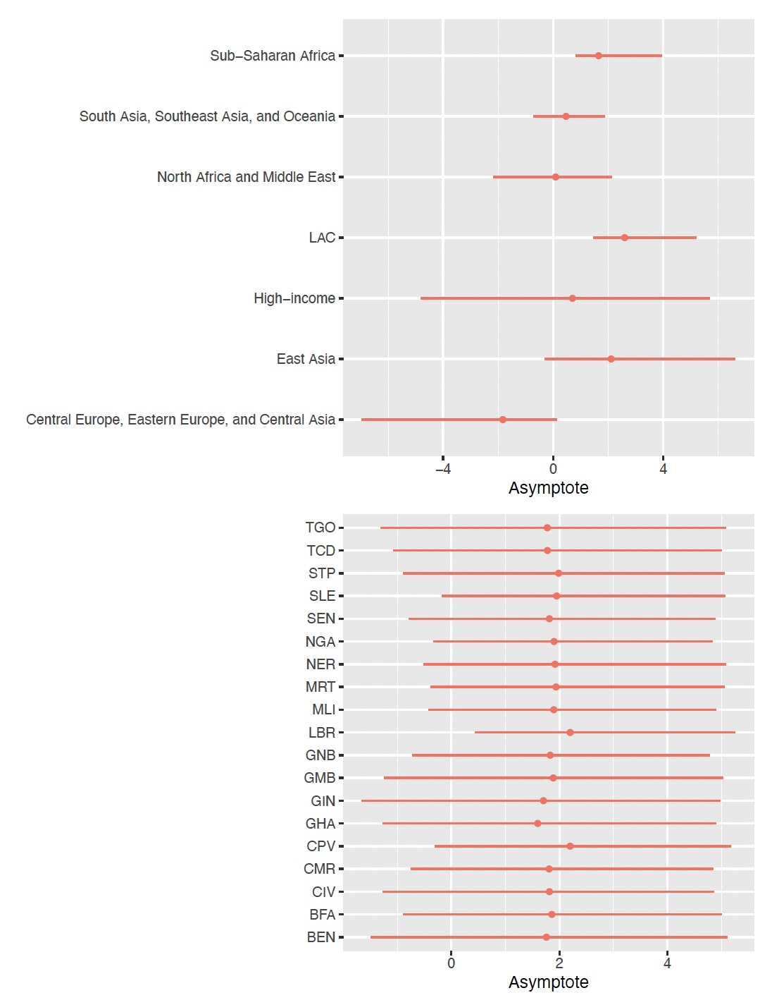

---
# # # for rendering to pdf
# title: ""
# author: ""
# # for rendering to html
title: "[Article] localhierarchy: an R package to facilitate fitting of global and local Bayesian hierarchical models"
author: "Leontine Alkema (lalkema@umass.edu), Shauna Mooney, Evan Ray, and Herbert Susmann"
# ## nope
# author:
#   - name: "Leontine Alkema"
#     affiliations:
#       - name: "Department of Biostatistics and Epidemiology, University of Massachusetts Amherst, USA"
#         id: "1"
#     email: "lalkema@umass.edu"
#   - name: "Shauna Mooney"
#     affiliations:
#       - name: "Hamilton Institute and Department of Mathematics and Statistics, Maynooth University, Ireland"
#         id: "2"
#   - name: "Evan Ray"
#     affiliations:
#       - id: "1"
#   - name: "Herbert P. Susmann"
#     affiliations:
#       - name: "Division of Biostatistics, Department of Population Health, NYU, USA"
#         id: "3"
date: today
format:
  html:
    number-sections: true
  # pdf:
  #   number-sections: true
  #   latex-engine: pdflatex
  #   include-before-body: title.tex
  #   include-in-header:
  #     - file: preamble.tex
#  docx: default  # Enable if you want Word output format as well
editor: visual
# execute:
#   cache: true

abstract: |
  Bayesian hierarchical models are widely used in global health estimation, where data availability may vary across national or subnational populations. Such models are typically fitted to a global database, e.g., to produce national-level estimates for all countries in the world or in some region. To facilitate analysis at a local level, models are often desirable that are informed by global models but can be fitted to just a subset of the data, such as data for one country. We refer to such models as local models: models that are derived from global hierarchical models but adapted such that they can be fitted to the data from one population alone.

  We present the `localhierarchy` R package, which provides functionality for fitting Bayesian hierarchical models in settings where both global and local estimation is required. The package provides R functions and Stan model components to support global modeling, in which all parameters in hierarchical models are estimated, and local modeling, in which parameters are estimated for only one or a small number of populations, using fixed values from a global model fit.

  This article presents a practical introduction to the package for the applied user and illustrates the package’s functionality through examples for national estimation.
keywords: Bayesian hierarchical model; R; Stan; Local models for one population
bibliography: bibliography.bib
---

```{r}
#| include: false
library(localhierarchy)
```

# Introduction

In global health estimation, Bayesian hierarchical models have become a cornerstone methodology, enabling the integration of diverse data sources to produce reliable estimates across multiple populations and regions. For example, they are used to estimate and forecast family planning indicators for the FP2030 initiative [@alkema_2024evol], incidence of low birth weight [@okwaraji_national_2024], abortion and unintended pregnancies rates [@bearak_unintended_2020], and maternal mortality by the United Nations Interagency Group [@peterson_bayesian_2024]. In these efforts, national or subnational estimates are often required for population-periods with limited data availability. In these contexts, Bayesian hierarchical models -— whether used directly or for specific components within larger modeling frameworks -- are valuable because they facilitate the sharing of information across populations. Global modeling exercises typically fit Bayesian hierarchical models to comprehensive global databases, producing national-level estimates for all countries worldwide.

To facilitate analysis of a single population, it is often desirable to use models that are informed by global models but can be fitted to just a subset of the data, such as data from a single country. We refer to these as local models: models derived from global hierarchical models but adapted to be fit using data from only one population. Beyond allowing model fitting to smaller, specific datasets, local models offer practical advantages such as faster computation, making it feasible for users to perform analyses quickly on their own computers. Additionally, local models enable estimates for different populations to be updated independently, for example, when new data become available. This approach has been used successfully in global estimation exercises for family planning and maternal mortality [@alkema_2024evol; @peterson_bayesian_2024].

A key challenge in the use of local models in global health estimation is synchronizing codebases and data flows between global and local estimation approaches. Synchronization is important because fitting local models relies on parameter estimates from global models. Therefore, synchronization is necessary to ensure consistency across global and local models. This can be particularly challenging for modeling approaches that involve hierarchical estimation of multiple parameters, where the hierarchical structures may differ across parameters.

This paper introduces the \texttt{localhierarchy} R package designed to address these challenges by supporting the development and fitting of Bayesian hierarchical models in settings requiring both global and local estimation. The package provides R functions and Stan functions and model blocks [@stan2025] to facilitate specification of hierarchical models, to fit full global models, and to subsequently fit local models using fixed parameter values inferred from the global analysis. Through this framework, users can conveniently perform local inference informed by global context, streamlining workflows in global health estimation tasks.

This article presents a practical introduction to the \texttt{localhierarchy} package [@localhierarchy] along with illustrative case studies demonstrating its applicability. The article is organized as follows. The next section introduces the modeling approach and workflow used for estimating family planning indicators, motivating the need for the \texttt{localhierarchy} functionality of fitting global and local hierarchical models. The methods section introduces the package's functionality for the estimation of one parameter at the national level. Finally, we return to the case study of family planning estimation to present illustrative results of the application of the \texttt{localhierarchy} setup in this context.

# The Family Planning Estimation Tool (FPET) {#sec-fpet}

To motivate the utility and use of the \texttt{localhierarchy} package, we focus on the Family Planning Estimation Tool (FPET) as an illustrative example [@alkema_2024evol]. FPET is widely used to estimate key family planning indicators in countries and regions. Key indicators include modern contraceptive use, demand for family planning, and demand satisfied, referring to the ratio of modern contraceptive use to demand. Data on such indicators is available from household surveys and routine data systems. FPET estimates are obtained from fitting a Bayesian model to available data. An illustration of FPET estimates and available data is shown in @fig-localfits for three countries in Western Africa.

{#fig-localfits}

At its core, the Bayesian FPET model employs transition models for demand and demand satisfied to characterize the long-term trajectories of family planning indicators over time within a population [@susmann_flexible_2025], illustrated in @fig-transition. The transition model describes changes in an indicator in terms of three principal parameters: the rate of change, the timing of the transition, and the asymptotic level (the maximum attainable level for an indicator). To allow for population-specific variation in how family planning indicators evolve, the parameters of the transition model are population-specific.

{#fig-transition width="476"}

Given limited country-specific information on some parameters, Bayesian hierarchical models are used to share information between populations, using hierarchical structures such as the one illustrated in @fig-hierstruc. Specifically for family planning estimation and forecasting, a hierarchical model is used to estimate the level of demand in a reference year and the asymptote of the transition of demand from low to high values. @fig-level shows estimates of the level in the reference year at the country level for countries in Western Africa, and for the groupings used in the hierarchical model. @fig-asympt shows estimates for the asymptote. These figures show variation in levels among countries in Western Africa, informed by country-specific data. Estimates of asymptotes are similar across countries in Western Africa because countries have not yet reached the end phase of their transition. The asymptotes of these Western African countries are informed by the estimate of the asymptote in sub-Saharan Africa through the hierarchical model.

{#fig-hierstruc width="631"}

{#fig-level width="629"}

{#fig-asympt width="652"}

The workflow used in FPET to produce country-level estimates is as follows. First, the full Bayesian model is fit to a global data base of survey data. Data base compilation is carried out by the United Nations Population Division (see [UNPD world contraceptive use website](https://www.un.org/development/desa/pd/world-contraceptive-use)) and the Track20 project (see [www.track20.org](https://www.track20.org/)). The global model fit provides information on model parameters, including hierarchical parameters, e.g., estimates of asymptotes. Subsequently, a local model can be used to produce FP estimates based on the data from one country, using information from the global model fit. The technical details for this approach are given in the next section. We return to the application of estimating family planning indicators in @sec-fpetnat.

\clearpage

# Methods

The modeling approach introduced in `localhierarchy` was motivated by applications like FPET that depend on hierarchical structures associated with national and subnational level estimation, requiring global and local models to be fit. In this section, we introduce the principle setup used for global and local hierarchical models in the context of national estimation. We use general notation and a specific example.

## Hierarchical model specification

Suppose we want to estimate a population parameter $\mu_r^{(l)}$ of interest, referring to a population health indicator for region $r$ at level $l$ of the hierarchy. For example, the indicator could refer to some population health indicator such as service coverage or morbidity or mortality-related outcomes. For a given level $l$, index $r$ refers to the population in a particular region indexed by $r$, for example, a subnational region, a country, or a group of countries. We assume that $\mu$ is unconstrained (possibly after a transformation has been applied) and consider the following general hierarchical model setup (see @fig-hiermodel):

\begin{align*}
  \mu_{r}^{(l)} \mid \mu^{(l-1)}_{r^\prime}, \sigma_l &\sim N(\mu^{(l-1)}_{r^\prime}, \sigma_l^2), \text{ for } l > 0,
\end{align*} where $\mu^{(l-1)}_{r^\prime}$ is the parameter value at one level higher in the hierarchy for the region $r^\prime$ that contains unit $r$. The parameter $\sigma_l$ for $l > 0$ describes variability of values of the parameter $\mu$ across geographic units at level $l$ of the hierarchy. At the top level of the hierarchy, $l = 0$, only a single parameter is estimated.

{#fig-hiermodel width="613"}

As a specific example, we consider the estimation of country-specific parameters, where countries are organized into subregions of countries (illustrated in Figure \ref{fig-hiermodel}). In this setting, using alternative notation for the same setup to indicate the level by name, the hierarchical model can be written as follows:

\begin{alignat}{2}
  \mu_c^{(\mathrm{country})} &\mid \mu_{s[c]}^{(\mathrm{subregion})}, \sigma_{ \mathrm{country}}^2 &&\sim N(\mu_{s[c]}^{(\mathrm{subregion})}, \sigma_{ \mathrm{country}}^2), \label{eq-countryhier} \\
  \mu_s^{(\mathrm{subregion})} &\mid \mu_{w[s]}^{(\mathrm{region})}, \sigma_{ \mathrm{subregion}}^2 &&\sim N(\mu_{w[s]}^{(\mathrm{region})}, \sigma_{\mathrm{subregion}}^2), \nonumber \\
  \mu_w^{(\mathrm{region})} &\mid \mu^{(\mathrm{global})}, \sigma_{ \mathrm{region}}^2 &&\sim N(\mu^{(\mathrm{global})}, \sigma_{ \mathrm{region}}^2), \nonumber
\end{alignat} where $c =1,\dots,C$ refers to the country index, $s[c] = 1, .., S$ to the subregion index of country $c$, and $w[s[c]] = 1, .., W$ to the region index of subregion $s[c]$. The parameter $\mu^{(\mathrm{global})}$ is the global mean for the parameter of interest, e.g., a global mean for service coverage or mortality. The parameters $\sigma_{ \mathrm{country}}$, $\sigma_{ \mathrm{subregion}}$, and $\sigma_{ \mathrm{region}}$ describe variability in the parameter of interest across countries, subregions, and regions, respectively.

## Local hierarchical models

We use the term local hierarchical models to refer to a hierarchical model in which a subset of parameters have been fixed at posterior mean estimates obtained from a fit of the model to a larger data set. A typical workflow for local estimation of national level outcomes is illustrated in @fig-workflow. For national estimation using the model given by Eq.\ref{eq-countryhier}, the user starts by fitting a global model, using a global data base and estimating all parameters in a hierarchical model. In a local model, data from one country are used and parameters that are not country-specific are fixed using parameter estimates from the global model fit.

{#fig-workflow width="614"}

A local model is derived from a global one by fixing parameters. Continuing with the specific example, an example local model to produce country estimates using data from one country alone has the following setup:

$$\mu_c^{(\mathrm{country})} \sim N(\hat{\mu}_{s[c]}^{(\mathrm{subregion})}, \hat{\sigma}_{ \mathrm{country}}^2),$$ replacing the hierarchical mean and variances by point estimates $\hat{\mu}_{s[c]}^{(\mathrm{subregion})}$ and $\hat{\sigma}_{\mathrm{country}}^2$, respectively. Details are given in the implementation section.

The `localhierachy` package provides a general implementation of local models by facilitating the fixing of subsets of parameters. Continuing with the general notation introduced above, in the package, a local model for one parameter of level $l$ is derived by fixing $\sigma_k$ for $k=1, ..., l$ and fixing $\mu_{\cdot}^{(k)}$ for $k = 1, .., l-1$ at posterior means derived from a global fit. More generally, if a model was fitted using data up to level $l$, the user can create a local model by fixing $\sigma_k$ at all levels $k$ up to some chosen level $K_{\sigma}$. Similarly, the $\mu^{(k)}$ parameters can be fixed at all levels $k$ up to a level $K_{\mu} \leq K_{\sigma}$.

## Implementation {#sec-implementation}

The `localhierarchy` R package contains R functions and example Stan model files to fit global and local hierarchical models. The package is set up to allow for users to incorporate the global-local hierarchy setup into their own project. For a given parameter and hierarchical model specification, the package functions enable processing of data to produce Stan input data for global and local models, Stan model components that work for both global as well as local models, and R functions for post-processing of model outputs to check results and produce summary files of global models for use in local models.

In a typical work flow, a user first fits a global model, followed by local ones. A worked example is given in the use case in @sec-nationalusecase. The global and local models in these examples are fitted using the `localhierarchy` wrapper function `fit_model_localhierarchy`, using its arguments to specify a hierarchical model, data, and, for local fits, the output of the global model. The wrapper function calls R functions to process data and prepare Stan input data, read in a Stan model, fit the model, and post-process the results.

The package includes a user-friendly specification of hierarchical model structures, and associated specification of fixed parameters for local runs. A worked example is given in @sec-nationalusecase. Briefly, if a user wants to specify a hierarchical model with the levels world, regions, subregion, and country, <!-- country parameters $\mu_c^{(\mathrm{country})} =  s_{global}\cdot \gamma_{global} + \sigma_{ region}\cdot \gamma_{r[s[c]]]}^{(
egion)} + \sigma_{ subregion}\cdot\gamma_{s[c]}^{(\mathrm{subregion})} + \sigma_{ country}\cdot\gamma_{ c}$,  --> using a dataset with information on these groupings, with naming `region`, `subregion`, and `country`, in the R functions, the user can specify the hierarchical model as follows:

```{r, eval = FALSE}
hierarchical_level <- c("intercept",  "region", "subregion", "country")
```

The first level is the intercept, which is the global mean, followed by the region, subregion, and country levels. The user can then specify a local model for one country by fixing parameters at different levels, using the `hierarchical_sigmas_fixed` and `hierarchical_terms_fixed` arguments in the `fit_model_localhierarchy` function. For example, if the $\sigma$ parameters are to be fixed up to the country level and if the $\mu$ terms are to be fixed up to the subregion, the user can encode this as follows:

```{r, eval = FALSE}
hierarchical_sigmas_fixed <- c("intercept",  "region", "subregion", "country")
hierarchical_terms_fixed <- c("intercept",  "region", "subregion")
```

Note that even though there is no $\sigma$ at the intercept level, this term is always included in the `hierarchical_sigmas_fixed` vector.

The Stan implementation of the model uses a non-centered parameterization. In general notation, for $l>0$, a non-centered parameterization refers to writing mean parameters as deviations from higher-level group means: \begin{align*}
  \mu_r^{(l)} &= \mu^{(l-1)} + \sigma_l \cdot \gamma_{r}^{(l)},
\end{align*} where $\gamma_r^{(l)} \sim N(0, 1)$. Applied sequentially, and if $\mu^{(0)} \sim N(0,s_{\mathrm{global}})$ with prior standard deviation $s_{\mathrm{global}}$, we get \begin{align*}
  \mu_r^{(l)} &= s_{\mathrm{global}}\cdot\gamma^{(0)} + \sum_{k=1}^{l} \sigma_k \cdot \gamma_{r^\prime}^{(k)},
\end{align*} where $r^\prime$ now refers more generally to the index of the unit containing the lower-level group. For the specific example of country parameters, the non-centered parameterization is given by \begin{align*}
  \mu_c^{(\mathrm{country})} =  s_{\mathrm{global}} \cdot {\gamma}^{(\mathrm{global})} + {\sigma}_{\mathrm{region}}\cdot {\gamma}_{w[s[c]]]}^{(\mathrm{region})} + {\sigma}_{\mathrm{subregion}}\cdot{\gamma}_{s[c]}^{(\mathrm{subregion})} + {\sigma}_{\mathrm{country}}\cdot\gamma_{c}^{(\mathrm{country})}.
\end{align*}

Implementation is based on a model matrix. For our model given by the equation above, the following matrix multiplication is used to obtain the vector of $\mu_c^{(\mathrm{country})}$s: $$(\mu_1^{(\mathrm{country})}, ..., \mu_c^{(\mathrm{country})}) = M\cdot (\eta_1, ..., \eta_{1+R+S+C})',$$ where matrix $M$ is a sparse matrix with 1s and 0s, and $(\eta_1, ..., \eta_{1+R+S+C})$ refers to the vector of the product of the standard deviation terms and $\gamma$ terms, i.e., $\eta_1 = s_{\mathrm{global}}\cdot \gamma_{\mathrm{global}}, \eta_2 = \sigma_{ \mathrm{region}} \cdot \gamma_{ 1}^{(\mathrm{region})}, ..., \eta_{1+W+S+C} = \sigma_{ \mathrm{country}}\cdot\gamma_{ C}^{(\mathrm{country})}$. When estimating a subset of parameters in a local model, the values of $\sigma$s and $\gamma$s are fixed to point estimates (posterior means) from a global fit. For example, for a local national model, we get \begin{align*}
  \mu_c = s_{\mathrm{global}} \cdot \hat{\gamma}_{\mathrm{global}} + 
          \hat{\sigma}_{ \mathrm{region}} \cdot \hat{\gamma}_{w[s[c]]]}^{(\mathrm{region})} + 
          \hat{\sigma}_{ \mathrm{subregion}} \cdot \hat{\gamma}_{s[c]}^{(\mathrm{subregion})} + 
          \hat{\sigma}_{ \mathrm{country}} \cdot \gamma_{c}^{(\mathrm{country})}.
\end{align*}

## Operation

`localhierarchy` is a publicly available R package stored on Github. For usage, installation of R (≥4.5.1), Stan (≥2.37.0), and CmdStanR (≥ 0.9.0) are required [@WeloveR; @stan2025; @cmdstanr_2025]. The `localhierarchy` package can be installed from the Github repository. Package dependencies are listed in the package DESCRIPTION file and will be automatically installed upon installing the main package. There are no minimum RAM, CPU, or HARDDRIVE requirements apart from what is necessary to store model runs, which varies case-by-case.

# Use case: National estimation {#sec-nationalusecase}

We present a detailed use case of the `localhierarchy` package using simulated data, followed by an application of that functionality in FPET.

## Detailed example using simulated data

### Simulation setup

The simulation setup is as follows: For national level estimation, we consider countries to be grouped in the world, i.e., $$\mu_c^{(\mathrm{country})}|\mu^{(\mathrm{global})}, \sigma_{ \mathrm{country}} \sim N(\mu^{(\mathrm{global})}, \sigma_{ \mathrm{country}}^2).$$ The likelihood function for national data is given by a normal likelihood with constant variance: $$y_i^{(\mathrm{country})}|\mu_{c[i]}^{(\mathrm{country})}, \sigma_y^2 \sim N(\mu_{c[i]}^{(\mathrm{country})}, \sigma_y^2),$$ where $c[i]$ refers to the country of country observation $i$. We chose simple normal densities as data generating mechanisms in the simulation, to focus the modeling on the hierarchical model and the `localhierarchy` functionality as opposed to the data model aspects of modeling. In practice, the data model can be set by the user to reflect actual data generating mechanisms, for example, by using a binomial likelihood, considering transformed outcomes, or accounting for sampling errors for observations that were obtained from a complex survey design.

Simulated data were generated using the `simulate_multilevel_data` function. We simulate a set of model parameters, setting $\mu^{(\mathrm{global})} = 0$, and $\sigma_{\mathrm{country}} = 0.5$, creating 30 countries, and national data, using $\sigma_y = 0.1$.

```{r, echo = FALSE}
dat_all <- simulate_multilevel_data(
  n_levels = 2,
  n_units_perlevel = c(30, 20),
  sigma_perlevel = c(0.5, 0.2), # national and subnational level
  mu_global = 0,
  add_data = TRUE,
  n_data = 10,
  sigma_y = 0.1, # used for national and subnational data
  add_data1levelup = TRUE
)
dat_nat <- dat_all$data_1levelup
```

In the simulated data, `level1` refers to the country level. The data sets contain the simulated parameters (`eta`; the deviation away from the global mean) and data (`y`):

```{r}
dat_nat |> dplyr::select(level1,  mu_global, level1_eta, y)
```

### Model fitting

We can fit global and local models using the `fit_model_localhierarchy` wrapper function, as shown later in this section. We first provide implementation details, using the main functions of the package and excerpts from the Stan model.

For model fitting, the first step is to specify a hierarchical structure, using `intercept` and names included in the survey data. For national level estimation, `level1` is the name used in the data:

```{r}
hierarchical_level <- c("intercept",  "level1")
```

Input data are processed using the function `get_geo_unit_index_data`. This function obtains unique hierarchical groupings from the input data and assigns an index `c` to each unique grouping:

```{r}
geo_unit_index <- get_geo_unit_index_data(
  dat_nat,
  hierarchical_levels = hierarchical_level,
  area = "level1"
)
geo_unit_index
```

The second step in the processing is to create a hierarchical data object, using the function `hierarchical_data`. This function outputs a list with various components associated with the parameterization of the hierarchical parameters, used in the Stan model and for further post-processing:

```{r}
hier_data <- hierarchical_data(geo_unit_index, hierarchical_level)
names(hier_data)
```

Elements include the model matrix and other elements are used to make a link between columns in the model matrix, or equivalently, indices in the vector $\eta$, and the hierarchical groupings. The model matrix $M$, as introduced in @sec-implementation, is as follows:

```{r}
dim(hier_data$model_matrix$matrix)
hier_data$model_matrix$matrix[1:10, 1:10]
```

All of this information is passed to the function `hierarchical_param_stan_data` to produce inputs needed in the Stan model fitting. This function outputs a named list with Stan input data relevant to the hierarchical setup:

```{r}
hier_stan_data <- hierarchical_param_stan_data(
  param_name = "mu",
  param_data = hier_data
)
names(hier_stan_data)
```

For example, in this setting, we only have to estimate one $\sigma_{\mu}$, and no $\sigma_{\mu}$ is fixed, as recorded in the `n_sigma_estimate` and `n_sigma_fixed` elements of the Stan input data:

```{r}
hier_stan_data$mu_n_sigma_estimate
hier_stan_data$mu_n_sigma_fixed
```

We can use the function `fit_model_localhierarchy` to fit the model as specified so far. Details are included in the appendix (@sec-helpfilefitmodel). The argument `runstep` is used to define the type of model, setting it to `"global_national"` results in fitting a model to all data without fixing any parameters. Other arguments include the hierarchical level specification, the area, and survey data. When calling the function, print statements are used to inform the user of key points related to the model fit:

```{r}
global_fit <- fit_model_localhierarchy(
  runstep = "global_national",
  hierarchical_level = hierarchical_level,
  area = "level1",
  survey_df = dat_nat
)
```

When doing model fitting, the same Stan model is used for both global and local models. Excerpts from the Stan model are included in Appendix 1.

The `global_fit` object includes posterior samples and other metadata about the fit.

```{r}
names(global_fit)
```

The `post_summ` object contains posterior means for relevant model parameters. For example:

```{r}
global_fit$post_summ |> 
  dplyr::filter(variable_no_index == "mu_sigma")
```

A local fit can be estimated by passing on the global fit object to the wrapper function and including data for countries of interest. Here we do local runs for all countries, by including the entire data set, and specify what to fix using the `runstep` argument:

```{r}
fit_local <- fit_model_localhierarchy(
  runstep = "local_national",
  global_fit = global_fit,
  area = "level1",
  survey_df = dat_nat
)
```

When doing a local national run with `runstep = "local_national"`, the hierarchical levels are taken from the global fit, and non-country-specific parameters are fixed. This is indicated in the print statements above. In the wrapper function, relevant code excerpts for `"local_national"` runs are as follows:

```{r}
hierarchical_level <- global_fit$hierarchical_level
hierarchical_level_terms_fixed <- 
  hierarchical_level[1:(length(hierarchical_level)-1)]
hierarchical_level_sigmas_fixed <- 
  hierarchical_level[1:(length(hierarchical_level))]
```

When doing a local fit, the same R functions and Stan model are used as introduced above but Stan input data is updated to fix a subset of parameters. Specifically, when producing Stan input data, the following function call is used:

```{r}
hier_stan_data_local <- hierarchical_param_stan_data(
  param_name = "mu",
  param_data = hier_data, 
  # information to fix parameters 
  global_fit = global_fit,
  hierarchical_terms_fixed = hierarchical_level_terms_fixed, 
  hierarchical_sigmas_fixed = hierarchical_level_sigmas_fixed
)
```

Above, the arguments `hierarchical_terms_fixed` and `hierarchical_sigmas_fixed` are used to fix the $\mu$ at the intercept-level and the $\sigma$s up to and including the country-level. Indeed, when comparing the outputs of this function call to the one for a global fit, we find that the country $\sigma$ is fixed at the value from the global fit:

```{r}
hier_stan_data_local$mu_n_sigma_fixed
hier_stan_data_local$mu_n_sigma_estimate
hier_stan_data_local$mu_sigma_fixed
```

In addition to fixing parameters of hierarchical models, other non-country-specific parameters can be fixed as well. In this example, $\sigma_y$ is a global parameter that is fixed at the posterior mean from the global run for use in local runs.

### Processing model fits

The package includes several functions to produce and check outputs. The function `posterior_summary_hierparam` is used to summarize posterior draws for hierarchical parameters, to produce summaries of $\mu$ at any level of interest. It takes a fitted model object and a parameter name as input and returns a list with each entry referring one level, and the results (e.g., estimates for $\mu$ estimates) for that level. Here we obtain these results for the global and local model:

```{r, message=FALSE, warning=FALSE}
res_global <- posterior_summary_hierparam_localhierarchy(
  fit = global_fit, parname = "mu")
res_local <- posterior_summary_hierparam_localhierarchy(
  fit = fit_local, parname = "mu")
```

Example output for the global model is as follows:

```{r}
res_local$level1
```

The column `name` includes the country names, given by simple indices in this simulation. The column `quant` above refers to posterior means and upper and lower bounds of 95% credible intervals. We can create plots to show outputs, for example for the first 4 countries:

```{r}
plots <- plot_posterior_summaries_localhierarchy(
  res = res_global, 
  modelname1 = "global",
  hierarchy_select = "level1",
  areas_select = unique(res_local$level1$name)[1:4]
)

plots$level1
```

By plotting results from global and local models, we can check how estimates compare and how values have been fixed in the local runs. For example, here we see how country estimates compare between global and local models:

```{r}
plots <- plot_posterior_summaries_localhierarchy(
  res = res_local, 
  modelname1 = "local",
  res2 = res_global, 
  modelname2 = "global", 
  hierarchy_select = "level1",
  areas_select = unique(res_local$level1$name)[1:4]
)

plots$level1
```

Estimates are similar, as expected.

When visualizing higher levels, we see how parameters were fixed in the local model:

```{r}
plots <- plot_posterior_summaries_localhierarchy(
  res = res_local, 
  modelname1 = "local",
  res2 = res_global, 
  modelname2 = "global"
)

plots$intercept 
```

We can also create plots for the $\gamma$s (`mu_raw`s):

```{r, message=FALSE, warning=FALSE}
plots <- plot_muraw_localhierarchy(fit = global_fit, parname = "mu")
```

This gives a list with plots, including summary plots and plots with priors and posteriors. For example, the figures below show the first 30 $\gamma$s, followed by the prior-posterior densities for the first $\gamma$ (referring to the intercept).

```{r}
plots[["summary_plots"]][[1]]
```

```{r}
plots[["plots_allmuraw"]][[1]]
```

Plots with prior and posterior densities of the $\sigma$s can be produced as well:

```{r}
plot_prior_post_sigmas_localhierarchy(fit = global_fit, parname = "mu")
```

## Application: National estimation of family planning indicators using FPET {#sec-fpetnat}

For family planning estimation, a local model fitting approach was motivated by the need to enable country monitoring and evaluation (M&E) officers to produce estimates for their countries, as part of the Track20 project [@alkema_2024evol]. The Track20 project works to build the capacity of countries to generate and use data to inform their programming, improve impact, and accelerate progress toward their FP goals. One of the pillars of this approach is the cultivation of a network of M&E officers dedicated to increasing the quality and use of FP data. We developed the family planning estimation tool (FPET) as a local version of a global family planning model, for use by the M&E officers.

For local estimation of family planning indicators, the Bayesian model described in @sec-fpet is used. Specifically, hierarchical models are used for estimation of transition model parameters. The workflow used for estimating family planning indicators at the national level is based on model fitting in several steps, including the estimation of long-term trends in the first step, the estimation of all model parameters related to modern contraceptive use in a second step, the addition of information on the use of traditional methods of contraception in a third step, followed by local model fitting to produce estimates for all indicators of interest. The `localhierarchy` functionality is incorporated in the family planning modeling code base such that all steps are run with the same code base, and parameters can be passed from one model fit to another. Full details on this workflow and model specification are described elsewhere [@alkema_2024evol]. As an illustration, @fig-allfits shows global and local fits for modern contraceptive use, demand, and demand satisfied for selected countries in Western Africa. The global fit in red corresponds closely to the local fits, shown in green.

{#fig-allfits}

\clearpage



# Conclusions

Bayesian hierarchical models are widely used in global health estimation, where data availability may vary across national or subnational populations. For analysis at a local level, local models are often of interest, referring to models that are derived from global hierarchical models but adapted such that they can be fitted to the data from one population alone. To that end, we introduced the `localhierarchy` R package, which provides functionality for fitting Bayesian hierarchical models in settings where both global and local estimation is required.

We have used the `localhierarchy` functionality in multiple projects. We discussed the estimation of family planning indicators, for which country M&E officers use the local model to produce estimates at the national and subnational level. In this area, M&E officers have successfully used local models to produce national estimates since 2014. Availability of a local modeling tool has enabled users to do additional analyses and check sensitivity of estimates to specific data sources or data quality assumptions. In addition to fitting the model to survey data, users of the local family planning model can also incorporate additional data from routine information systems (e.g., the number of contraceptive commodities supplied at family planning facilities, see [@mooney_emu]). These use cases illustrate the value of local models to enable local analysis.

More recently, we have used the `localhierarchy` approach and functionality for estimating coverage indicators for the *Countdown to 2030 for Women’s, Children’s and Adolescents’ Health initiative.* This initiative focuses on “tracking progress of life-saving interventions for Reproductive, Maternal, Newborn, Child and Adolescent Health and Nutrition” in low- and middle-income countries, see [www. countdown2030.org](https://www.%20countdown2030.org/). By developing the `localhierarchy` package and providing use cases in this paper, we hope that this work can be useful for other global health modelers, to consider local modeling in their own work.

### Data availability statement {.unnumbered}

No data are associated with the software tool described in this article.

### Software availability {.unnumbered}

The R package is available at [github.com/AlkemaLab/localhierarchy](https://github.com/AlkemaLab/localhierarchy) [@localhierarchy]. This code is distributed under the MIT License. See the R package's LICENSE file for details.

### Grant information {.unnumbered}

This work was supported, in whole or in part, by the Gates Foundation (INV-00844 and OPP1192802). Under the grant conditions of the Foundation, a Creative Commons Attribution 4.0 Generic License has already been assigned to the Author Accepted Manuscript version that might arise from this submission.

# Appendix

## Appendix I: Excerpts from the Stan model

The same Stan model is used for both global and local models. Excerpts are given in this section to explain key components.

The first excerpt starts at the end in terms of model specification and concerns the specification of the hierarchical parameters $\mu_c$, using the `localhierarchy` Stan function `get_mu`:

```{r, eval = FALSE}
data {
  matrix[n_geounit, mu_raw_n_terms] mu_model_matrix;
}

transformed data {
  vector[rows(csr_extract_w(mu_model_matrix))] mu_model_matrix_w     
              = csr_extract_w(mu_model_matrix);
  array[size(csr_extract_v(mu_model_matrix))] int mu_model_matrix_v  
              = csr_extract_v(mu_model_matrix);
  array[size(csr_extract_u(mu_model_matrix))] int mu_model_matrix_u  
              = csr_extract_u(mu_model_matrix);
}

transformed parameters {
 vector[n_geounit] mu = get_mu(
    mu_star,
    mu_raw_n_terms,
    n_geounit,
    mu_model_matrix_w, mu_model_matrix_v, mu_model_matrix_u);
}
```

Here we use that $(\mu_1^{(country)}, ..., \mu_C^{(country)}) = M \cdot (\eta_1, ..., \eta_C)$, where matrix $M$ is a sparse matrix with 1s and 0s, and $(\eta_1, ..., \eta_c)$ refers to the vector with products of standard deviation and $\gamma$ terms. The function `get_mu` calculates the vector of $\mu_c^{(country)}$s from the vector of $\eta$s (`mu_star` in the Stan model) and a decomposition of $M$ into different parts $U$, $V$, $W$. This implementation uses the sparse representation of the model matrix $M$ with Stan functions `csr_matrix_times_vector` and `crs_extract`.

The second Stan model excerpt concerns the specification of the $\eta$s (`mu_star`). This vector is obtained by multiplying the parameter vector of $\gamma$s, which is referred to as `mu_raw` in the Stan model by their respective standard deviation, i.e., <!-- the vector containing $s_{\mathrm{global}}$ (labeled `mu_scalarprior_mean` in the Stan model) and  --> the parameter vector of stacked $\sigma$s (labeled `mu_sigma` in the Stan model). The model block contains the prior for the $\gamma$s and $\sigma_{k}$s, given by \begin{align*}
  \gamma^{(k)} &\sim N(0,1),\\
  \sigma_{k} &\sim \text{Half-Normal}(0, w_{0, \mu}),
\end{align*} where $w_{0, \mu}$ refers to the prior standard deviation for $\sigma_k$, called `prior_sd_sigma_estimate` in the Stan model file. The `localhierarchy` Stan function `get_mu_star` is used to carry out this multiplication to obtain the $\eta$s. The arguments for `get_mu_star` include prior parameters $m_{0, \mu}$, `mu_scalarprior_mean`, and $s_{0, \mu}$, `mu_scalarprior_sd`, which refer to the (rescaled) prior mean and standard deviation of $\mu^{(\mathrm{global})}$, where $\mu^{(\mathrm{global})} = s_{0, \mu}(m_{0, \mu} + \gamma^{(\mathrm{global})})$. Combined with the standard normal prior on $\gamma^{(\mathrm{global})}$, the resulting prior on the intercept $\mu^{(\mathrm{global})}$ is given by: \begin{align*}
  \mu^{(\mathrm{global})} &\sim N(s_{0, \mu}\cdot m_{0, \mu}, s_{0, \mu}).
\end{align*} All prior parameters ($m_{0, \mu}, s_{0, \mu}, w_{0, \mu}$) are added as input data to the Stan model.

To allow for global and local models, additions `_estimate` and `_fixed` are used to allow for splitting the `mu_raw` vector into two parts, one for fixed and one for estimated parameters. Similarly, vector `mu_sigma` is also split into two parts, one part for fixed and one part for estimated parameters. Relevant Stan code is as follows:

```{r, eval = FALSE}
data {
  // terms of hierarchical model
  int<lower=0> mu_raw_n_terms;
  int<lower=0> mu_raw_n_terms_fixed;
  int<lower=0> mu_raw_n_terms_estimate;
  int<lower=0> mu_n_sigma;
  int<lower=0> mu_n_sigma_fixed;
  int<lower=0> mu_n_sigma_estimate;
  array[mu_n_sigma + 1] int<lower=1, upper=mu_raw_n_terms> mu_re_start;
  array[mu_n_sigma + 1] int<lower=1, upper=mu_raw_n_terms> mu_re_end;
  // values of fixed parameters
  vector[mu_raw_n_terms_fixed] mu_raw_fixed;
  vector<lower=verysmallnumber>[mu_n_sigma_fixed] mu_sigma_fixed;
  // prior parameters
  real<lower = verysmallnumber> mu_scalarprior_sd;
  real mu_scalarprior_mean;
  real<lower = verysmallnumber> mu_prior_sd_sigma_estimate;
}

parameters {
  vector[mu_raw_n_terms_estimate] mu_raw_estimate;
  vector<lower=verysmallnumber>[mu_n_sigma_estimate] mu_sigma_estimate;
}

transformed parameters {
 vector[mu_raw_n_terms] mu_star = get_mu_star(
    mu_n_sigma, mu_n_sigma_fixed, mu_n_sigma_estimate,
    mu_sigma_fixed, mu_sigma_estimate,
    mu_scalarprior_mean,
    mu_scalarprior_sd,
    mu_raw_n_terms, mu_raw_n_terms_fixed, mu_raw_n_terms_estimate,
    mu_raw_fixed, mu_raw_estimate,
    mu_re_start, mu_re_end);
}
model {
  to_vector(mu_raw_estimate) ~ std_normal();
  to_vector(mu_sigma_estimate) ~ normal(0, mu_prior_sd_sigma_estimate);
}
```

## Appendix II: Documentation of the `fit_model_localhierarchy` function {#sec-helpfilefitmodel}

| **Argument** | **Description** |
|------------------------------------|------------------------------------|
| **`survey_df`** | Tibble with survey data |
| **`y`** | Column name of outcome, defaults to **`y`**. |
| **`area`** | Column name of the area of each observation (used as geounit; iso or subnational region) |
| **`area_select`** | Area name to use for local run (e.g., iso code or subnational region name) |
| **`runstep`** | Type of run, defines which model fitting step to perform (see Details for options). |
| **`global_fit`** | Optional global fit object, used to obtain fixed values for some parameters in the current fit (see Details). |
| **`hierarchical_level`** | Vector specifying hierarchical structure used for mu. Should list elements in hierarchical order from `intercept` downward (see Details for examples). |
| **`add_subnational_hierarchy`** | Level that's added to the hierarchy for subnational analysis, defaults to `subnat`. |
| **`use_globalsubnat_fromnat`** | Logical; for local subnational runs, whether to use the global fit derived from national data (requires **`fit_globalsubnat_fromnat`** in **`global_fit`** if TRUE). |
| **`mu_isvector`** | Logical, TRUE if mu is a vector, defaults to FALSE |
| **`chains`** | Number of chains to run (sampling parameter) |
| **`iter_sampling`** | Number of posterior samples to draw (sampling parameter) |
| **`iter_warmup`** | Number of warmup iterations (sampling parameter) |
| **`compile_model`** | Boolean indicator of whether to compile the Stan model |
| **`force_recompile`** | Boolean indicator of whether to force recompilation of the Stan model |
| **`seed`** | Random seed |
| **`refresh`** | Number of iterations between progress updates |
| **`adapt_delta`** | Target acceptance rate for the No-U-Turn Sampler |
| **`max_treedepth`** | Maximum tree depth for the No-U-Turn Sampler |

### Details

The `fit_model_localhierarchy` function fits the toy example for hierarchical models/seq fitting. The argument `runstep` determines the type of run to perform. The following run steps are supported:

-   "global_national": Fit the global model.

-   "local_national": Fit the model to data from a single country, using a global_national fit.

-   "global_subnational": Fit the model to global database with subnational data, using a global_national fit.

-   "local_subnational": Fit the model to subnational data from a single country or region, using a global_subnational fit. This is also explained in the documentation folder.

Details on hierarchical set ups used The package allows the structure of the hierarchical prior to be configured by the user through the `hierarchical_level` argument. These arguments expect a character vector that specifies a nesting hierarchical structure. Each element of the vector must be either "intercept" or a column name in the survey dataset, where "intercept" will add a global intercept for the parameter. The vector must be in descending order in terms of the hierarchy: that is, it starts with "intercept" and proceeds down the hierarchy.

For example, suppose we are fitting country-level data, where the dataset has columns "name_country", "name_sub_region", and "name_region" containing the name of the country, sub-region, and region that each observation belongs to. To specify that parameter mu should be fitted with a hierarchical model in which countries are nested within sub-regions within regions within world, we would use the argument `hierarchical_level = c("intercept", "name_region", "name_sub_region", "name_country")`.

Optionally, model parameters can be fixed to values from a previous model fit provided via the `global_fit` argument. In a typical use case, the `global_fit` will have been fit to data from many geographic units (e.g., all countries), while the current fit uses data from a smaller number of locations. When using a global_fit to fix parameter values, what exactly is fixed is determined by the runstep and global_fit combi. see options in function

### Value

List that contains samples, stan_data, other information relevant to model fit (arguments), and for global fits, point estimates of relevant parameters (post_summ). For subnational global fits, the list includes fit_globalsubnat_fromnat, which is the global fit with additional subnational sigmas added to the postsum object.

# References
